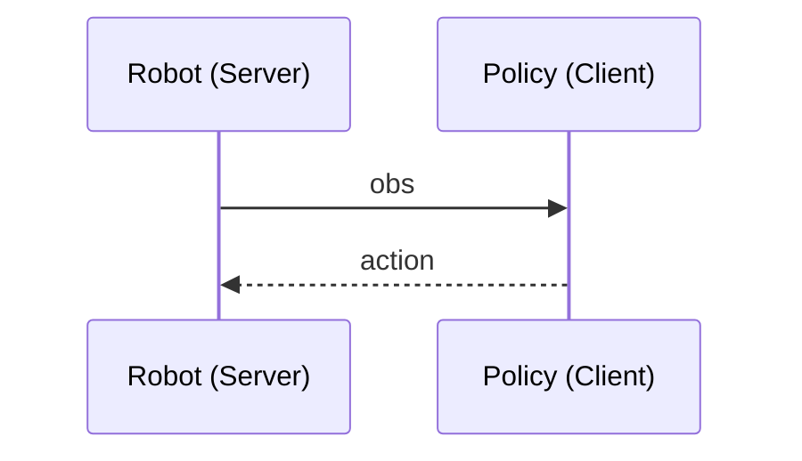

# Policy Server and Client

## 工作流程




## 注意事项

### 格式转化
Be carefull: 

- Cannot do: np.bytes -> json
- Can do: bytes -> json

### 服务器端口不可用：利用隧道
在本地的一个终端输入
```bash
ssh -p 6361 -L 9000:localhost:9000 root@120.48.23.252
```
> [!NOTE]
>
> **参数解析：**
>
> `9000:localhost:9000` 中：
>
> 左边的`9000`是本地的 TCP socket 或 Web socket 所用的端口
>
> 右边的`9000`是服务器的 TCP socket 或 Web socket 所用的端口
>
> 这两个数字**可以不同**。
>
> `-p 6361` 是指服务器的ssh端口，比如下面这样：
>
> ```bash
> Host baidu_a800
>     HostName 120.48.23.252
>     Port 6361
>     User root
> ```

然后在另一个终端启动对应的 client 程序

> [!CAUTION]
>
> 注意： 将服务器的公网IP换成`localhost`
>
> 对于`web_client.py`: 
> `server_url` 不是用`"ws://120.48.23.252:9000"` 而是`"ws://localhost:9000"`